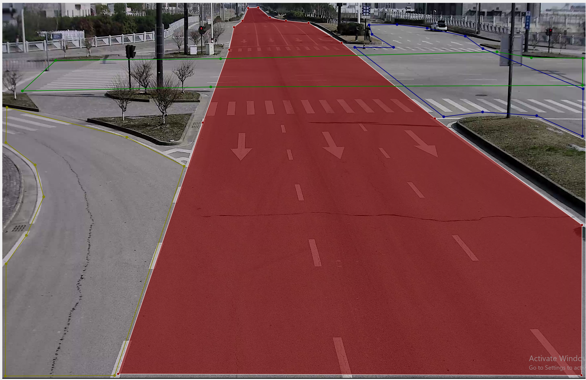
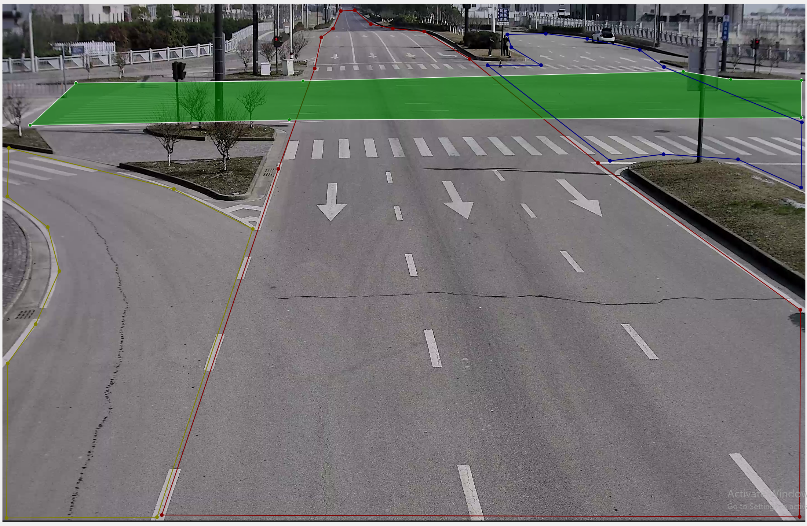
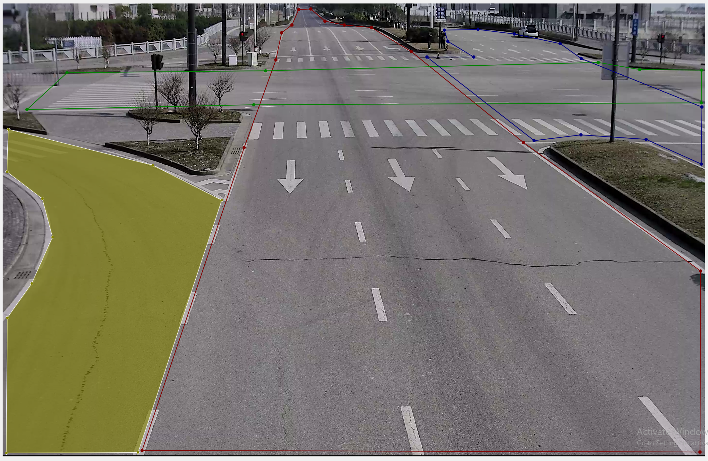

# Mask/ROI 区域生成
* Requirement：Numpy
* Language：Python3

## Features:
YOLOv8提取特征框后，为了方便寻找正确的接地点，同时剔除一些误检点，在底图上设置了一些ROI区域，如下图所示
<!-- 

 -->

./42_02.png 是原始图片，./42_02.json为原始图片的标注，标注可以使用Labelme来生成。
代码能够对json文件进行解析，并使用扫描线算法与bresenham算法分别图像标注的边缘与图像标注的内部区域，由此初步实现一些后处理功能。下图为代码生成的一个Demo:

## 使用方法
* polygons_to_mask(json_path, img_path)函数为主要函数，函数接收参数：json_path: json文件路径;                                             img_path: img路径

return：mask{'class_name': mask}

* poly_perimeter(points, mask) 使用bresenham算法计算边缘像素。point：标注点，mask：形如img的单通道矩阵

* polygon_fill(point, mask)使用扫描线算法计算边缘像素。point：标注点，mask：形如img的单通道矩阵